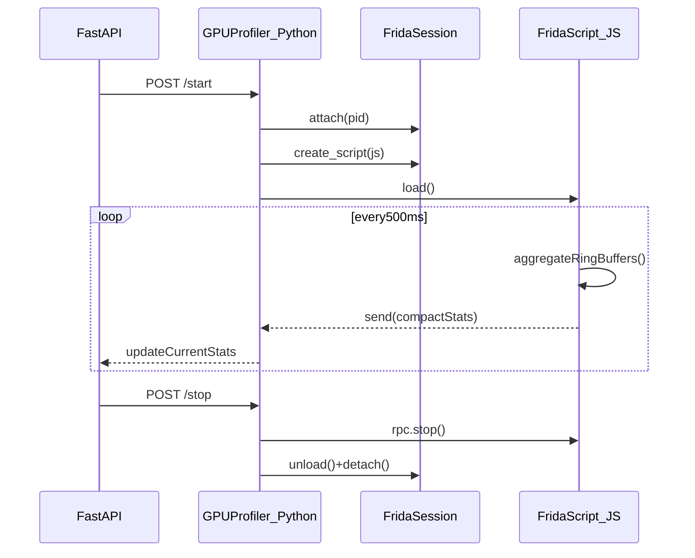

# Frida Metal profiler hardening plan

## Goals

- Make profiling safe for **continuous gameplay**: no render-thread stalls, no steady-state freezes.
- Ensure **repeatable attach/detach** without accumulating instability.
- Keep data quality good enough for frame pacing analysis, while allowing future “burst capture” expansion if needed.

## Key design changes

### 1) Replace `frida` CLI subprocess with Frida Python bindings

- Implement attach/detach via `frida.attach(pid)` and `session.detach()` instead of `subprocess.Popen(['frida', ...])` in [`/Users/jackmazac/Development/macos-modmanager/app/core/gpu_profiler.py`](/Users/jackmazac/Development/macos-modmanager/app/core/gpu_profiler.py).
- Use script `on_message` callbacks to receive `send()` payloads (no stdout/stderr pipe backpressure).
- Add a single-flight async lock so `/start` is idempotent and concurrent calls can’t create multiple sessions.

### 2) Make all render-path hooks “constant time”

Update all Frida scripts ([`/Users/jackmazac/Development/macos-modmanager/scripts/frida/frame_timing_analyzer.js`](/Users/jackmazac/Development/macos-modmanager/scripts/frida/frame_timing_analyzer.js), [`/Users/jackmazac/Development/macos-modmanager/scripts/frida/metal_profiler.js`](/Users/jackmazac/Development/macos-modmanager/scripts/frida/metal_profiler.js), [`/Users/jackmazac/Development/macos-modmanager/scripts/frida/aapl_optimization_probe.js`](/Users/jackmazac/Development/macos-modmanager/scripts/frida/aapl_optimization_probe.js), and the embedded scripts inside [`/Users/jackmazac/Development/macos-modmanager/app/core/gpu_profiler.py`](/Users/jackmazac/Development/macos-modmanager/app/core/gpu_profiler.py)):

- **Hard rule**: hooks for `CAMetalLayer -nextDrawable`, `presentDrawable:`, `commit` only:
  - record timestamp/counters into fixed-size arrays / ring buffers
  - avoid `console.log`, large `send()` payloads, `JSON.stringify`, ObjC reflection, stack traces
- Move all aggregation/reporting to a **low-frequency timer** (e.g., 1–2 Hz) that sends a *small* payload.

### 3) Eliminate high-risk synchronous scanning and class enumeration during gameplay

- Remove/disable `Memory.scanSync(...)` of the full `Cyberpunk2077` module in continuous mode.
  - Replace FSR/MetalFX “detection” with:
    - ObjC class presence checks (`ObjC.classes.MTLFXTemporalScaler`, etc.), and/or
    - out-of-process binary analysis (already exists via `analyze_binary(...)`).
- Remove `ObjC.enumerateLoadedClasses(...)` hooking strategies in continuous mode.
  - Prefer one-time `ApiResolver('objc').enumerateMatches` with *narrow* patterns and an allowlist of class name prefixes (e.g., `MTL*`), performed after a short delay (e.g., `setTimeout`) to avoid attach-time hitch.

### 4) Add explicit “lifecycle + cleanup” to scripts

- Implement `rpc.exports` in each script to support:
  - `start()` / `stop()` (enable/disable reporting)
  - `status()`
  - `setConfig({ ... })`
- Track interval IDs and clear them in `stop()` and in `Script.bindExitHandler`.
- Ensure hooks are installed once, and reporting can be toggled without re-attaching hooks.

## Concrete file-by-file changes

### A) Frida scripts

- [`/Users/jackmazac/Development/macos-modmanager/scripts/frida/frame_timing_analyzer.js`](/Users/jackmazac/Development/macos-modmanager/scripts/frida/frame_timing_analyzer.js)
  - Stop calling `generateReport()` from inside `presentDrawable:` hook.
  - Remove/replace `ObjC.enumerateLoadedClasses(...)` approach.
  - Remove `detectFSRVersion()` full-module `Memory.scanSync` in continuous mode.
  - Add ring buffer + timer-driven aggregation + compact `send({type:'frame_timing', ...})`.

- [`/Users/jackmazac/Development/macos-modmanager/scripts/frida/metal_profiler.js`](/Users/jackmazac/Development/macos-modmanager/scripts/frida/metal_profiler.js)
  - Reduce hook scope: disable shader/memory/raytracing hooks by default in continuous mode.
  - Change reporter to **send-only** (no console spam), with small payload and lower cadence.
  - Ensure any ObjC object inspection is either removed or heavily sampled.

- [`/Users/jackmazac/Development/macos-modmanager/scripts/frida/aapl_optimization_probe.js`](/Users/jackmazac/Development/macos-modmanager/scripts/frida/aapl_optimization_probe.js)
  - Remove/disable `probeConfigValues()` synchronous scans in continuous mode.
  - Keep periodic status, but send compact deltas; avoid repeated verbose console output.

### B) Python orchestration

- [`/Users/jackmazac/Development/macos-modmanager/app/core/gpu_profiler.py`](/Users/jackmazac/Development/macos-modmanager/app/core/gpu_profiler.py)
  - Replace CLI subprocess execution with Frida bindings.
  - Maintain:
    - `GPUProfiler.start(pid)` attaches and loads script
    - `GPUProfiler.stop()` unloads script, detaches session
  - Replace `_read_stats()` with an `on_message` handler that updates `current_stats`.
  - Add `asyncio.Lock` to serialize start/stop.

### C) API

- [`/Users/jackmazac/Development/macos-modmanager/app/api/profiler.py`](/Users/jackmazac/Development/macos-modmanager/app/api/profiler.py)
  - Keep endpoints, but ensure:
    - `/start` is idempotent
    - `/stream` emits proper JSON (not Python dict repr) and doesn’t rely on blocked background readers.

## Data flow (new steady-state)

## Validation / tests

- Add a stress test command (dev-only) that runs **N attach/detach cycles** and records:
  - attach time, detach time, game responsiveness, error rate.
- Add runtime metrics:
  - message rate, dropped message count, average hook cost sampling (optional).

## Rollout strategy

- Introduce a new “SafeContinuous” profile first; keep existing scripts available behind an “experimental” flag.
- Verify safe mode can run 10–30 minutes without FPS collapse or hangs.

## Open risks (explicit)

- Some Metal implementations differ across macOS versions; method resolution must be robust and allow for “no matches” without retry loops.
- Even with safe hooks, **hook count** must stay low; we will enforce explicit allowlists and sampling.